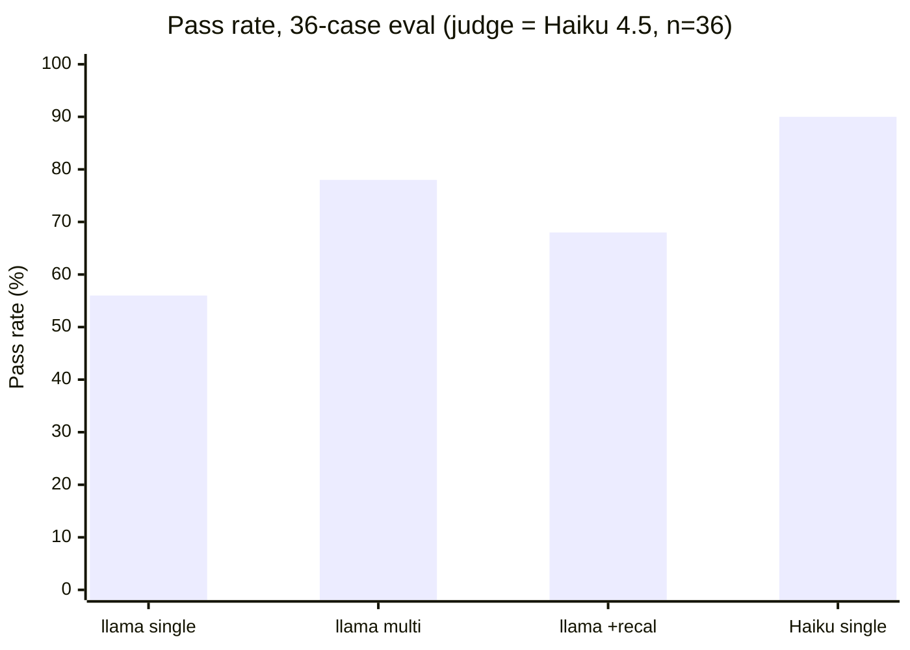

# On-Call Copilot


A tiny, provider-agnostic AI assistant for on-call engineers. Ask it *"checkout is throwing 5xx, what do I do?"* and it retrieves the relevant runbook (RAG), investigates with read-only tools (live metrics, deploys, logs) in a model-driven agent loop, and returns a **cited, grounded** answer — proposing fixes like a rollback but never executing them. The same app runs on **OpenRouter, Anthropic, OpenAI, or Gemini** by flipping one env var, and ships with an **eval harness** that scores correctness, tool-choice, and safety behind a pass-rate gate.

>  **Note:** this is a **personal learning project built on mock data (in process of being extended to a real use case for Ops)** (`data/` and `docs/` are made-up). It demonstrates the patterns — RAG, tool use, agent loop, MCP, evals, provider abstraction — not a production system. The eval numbers below are **real outputs from this repo**, including the cases it *fails*.

I approach this the way I'd approach a production system: don't trust an answer you can't check. So every reply is grounded in a retrieved runbook or a live tool result (and cited), the tools are read-only by construction so a wrong answer can't do damage, and an eval harness measures whether it actually behaves — the cases it still fails included.

## Results at a glance

**Metric — pass rate** on a **36-case labelled eval** (n = 36): a case passes only if it's **correct** (an independent LLM judge confirms the answer conveys the key facts) *and* calls the **right live-data tool** *and* stays **safe** (no forbidden claim, e.g. never falsely "healthy"). That's task accuracy on a held-out labelled set — the standard "does it actually work?" measure.

**Ablation** — judge (`claude-haiku-4-5`) held **fixed** at n = 36. Two levers move the score: the **pipeline** (rows 1–3, answerer held at the small open model) and the **answerer** (row 4):

| Answerer | Pipeline | Pass rate | vs. row 1 |
|---|---|---|---|
| `llama-3.3-70b` (small, open) | single-agent | 20/36 = **56%** | — |
| `llama-3.3-70b` | governed multi-agent | 28/36 = **78%** | **+22 pts** ✅ |
| `llama-3.3-70b` | multi + "recalibrated" verifier | ~68% (3 runs: 69/64/69) | **−10 pts → reverted** ✗ |
| **Claude Haiku 4.5** (small, frontier) | single-agent | ~**91%** (3 runs: 92/89/92) | **+34 pts** ✅ **OPEN** |

*Historical rows were measured on the 36-case set; the dataset has since grown (now 40 cases with the new ops tools) — tables will be re-baselined when evals move to CI.*



**How to read this honestly** — the lessons a metric is *for*:
- **The answerer is the biggest lever.** Swapping the small *open* model for a small *frontier* one (Haiku) beat *everything* orchestration did to the weak model — +34 pts, and it's the only config to clear the 80% gate. On its own. *(Caveat: that row is self-graded — Haiku answered and judged — so it's a touch optimistic; but +34 is far beyond any self-preference bias, and 2 of its 3 fails are objective `safe` checks. The llama rows use the same Haiku judge but aren't self-graded.)*
- **Orchestration helps a weak model, within limits.** `llama` single → multi is **+22** — real (a large delta, beyond the ~±3-case run noise) — but still under the gate. Governance can't fully compensate for a weak base model.
- **The "recalibration" is a reported *negative* result.** I hypothesised a two-sided critic would help; across **3 seeds** it sat ~10 pts *below* plain multi, so I **reverted it**. Knowing a change *didn't* work is the whole reason you measure.
- **Caveat:** few-seed numbers — tighter error bars need more runs, but batch throughput (rate limits) caps that. Full method + per-change history: [eval scorecard](#eval-scorecard-real-reproducible) ↓ and [`IMPROVEMENTS.md`](./IMPROVEMENTS.md).

## Architecture

```
                 ┌─────────────────────────────────────────────────────────┐
   you ask  ───► │  agent.py  (observe → act → observe, max 5 steps)         │
 "checkout 5xx"  │                                                           │
                 │   1. RAG: retriever.py  ──► top-k runbook chunks + [cite] │
                 │   2. LLM decides: answer, or call a tool?                 │
                 │   3. run read-only tool ──► feed result back ──► repeat   │
                 └───────────────┬───────────────────────────┬───────────────┘
                                 │                           │
                    ┌────────────▼───────────┐   ┌───────────▼───────────────┐
                    │ tools.py (READ-ONLY)   │   │ llm.py  (one interface,    │
                    │  list_services         │   │          many providers)   │
                    │  get_metric            │   │   ┌─────────────────────┐  │
                    │  recent_deploys        │   │   │ OpenRouter (default)│  │
                    │  search_logs           │   │   │ Anthropic · OpenAI  │  │
                    │  get_runbook           │   │   │ Gemini              │  │
                    │  get_alerts            │   │   └─────────────────────┘  │
                    │  get_incident_timeline │   │                            │
                    └────────────┬───────────┘   └────────────────────────────┘
                    reads mock   ▼
                    data/*.json,jsonl + docs/*.md
                                 │
   The same 7 tools are ALSO exposed over MCP ──►  mcp_server/server.py
   (so Claude Desktop / Claude Code / any MCP client can use them)
                                 │
   Quality is proven, not vibed ──►  evals/run_evals.py + evals/dataset.jsonl
   (LLM-as-judge correctness • tool-choice • safety • pass-rate gate)
```

## Run it

```bash
pip install -r requirements.txt
cp .env.example .env            # then fill in ONE key (or just export the vars below)

# Pick a provider (OpenRouter needs no Claude/OpenAI subscription).
# The AGENT needs a tool-capable model; pure RAG/eval works on any model.
export PROVIDER=openrouter
export OPENROUTER_API_KEY="sk-or-..."          # or ANTHROPIC_API_KEY / OPENAI_API_KEY

python app.py                 # interactive CLI — try: checkout is throwing 5xx, what do I do?
python -m evals.run_evals     # scorecard + ship gate over 40 labelled incidents
python -m unittest discover tests   # keyless checks (schema, tools, gate tripwire) — same as CI
python mcp_server/server.py   # expose the 7 tools over MCP (stdio)
python -m viz.server          # live visualizer → open http://localhost:8000

# swap the brain any time:  export PROVIDER=anthropic | openai | openrouter | gemini
```

The **judge/verifier** runs on a *different* model than the answerer so it isn't grading its own work. The default is **all-OpenRouter** (answer with `llama-3.3-70b`, judge with `gemma`) — one key, no Anthropic/OpenAI needed. Override with `JUDGE_PROVIDER` / `JUDGE_MODEL`.

### Configuration (environment variables)

Everything is env-driven; nothing hardcodes a vendor. Sensible defaults mean the only thing you *must* set is one API key.

| Variable | Default | What it does |
|---|---|---|
| `PROVIDER` | `openrouter` | Answering backend: `openrouter` \| `anthropic` \| `openai` \| `gemini`. |
| `OPENROUTER_API_KEY` / `ANTHROPIC_API_KEY` / `OPENAI_API_KEY` / `GEMINI_API_KEY` | — | Key for the chosen provider(s). |
| `OPENROUTER_MODEL` | `meta-llama/llama-3.3-70b-instruct` | Answering model on OpenRouter (needs tool support for the agent). |
| `ANTHROPIC_MODEL` / `OPENAI_MODEL` | `claude-sonnet-4-5` / `gpt-4o` | Answering model for those providers. |
| `JUDGE_PROVIDER` / `JUDGE_MODEL` | `openrouter` / `google/gemma-4-31b-it:free` | Global fallback for the judge/verifier roles (overridden by `models.json` / `MODEL_JUDGE`). |
| `MODEL_<ROLE>` / `PROVIDER_<ROLE>` | from `models.json` | Per-role model override — `ROLE` ∈ `INVESTIGATOR·TRIAGE·VERIFIER·POSTMORTEM·JUDGE`. See "Per-role models" below. |
| `ONCALL_MODE` | `single` | `single` = one investigator agent; `multi` = governed pipeline (triage→investigate→verify→postmortem). |
| `RETRIEVAL_MODE` | `keyword` | `keyword` (zero-dep) \| `semantic` \| `hybrid` (keyword + local embeddings; needs `sentence-transformers`, falls back to keyword if absent). |
| `GUARDRAILS_FILE` | `guardrails.json` | Path to the guardrail policy. |
| `ONCALL_LOG_DIR` | `logs/` | Where per-run JSONL traces are written. |
| `EVAL_WORKERS` | `1` | Run eval cases concurrently (thread pool). `4–5` is a big wall-clock win; too high just hits rate limits. |
| `VIZ_PORT` | `8000` | Port for the live visualizer. |

**Judge/verifier independence (important):** to avoid a model grading its own work, the judge is a *different* model than the answerer. The default is **all-OpenRouter** — answer with `llama-3.3-70b`, judge with `gemma` — so you need **one OpenRouter key and nothing else** (no Anthropic/OpenAI, no extra cost).
  > **On `:free` models:** they throttle under load, so a full eval can stall on a free judge (the client retries, but it's flaky). A small judge also grades a little more strictly than a frontier one — a real cost/quality trade-off. When I want a steadier judge I point `JUDGE_MODEL` at a stronger model. (In testing, `gemma-4-31b-it:free` answered cleanly; `qwen3-next-80b:free` was throttled.)
- If the judge client can't be built (e.g. no key for its provider), the verifier **falls back to the answering model and reports that independence was lost** — shown on the verifier card in the visualizer and in the run log, never hidden.

### Per-role models

Every agent role can run on its own model — route a cheap/fast model to triage, a reasoning model to the verifier, a writer to the postmortem, and a tool-capable one to the investigator. Defaults live in [`models.json`](./models.json); override any role with `MODEL_<ROLE>` (and optional `PROVIDER_<ROLE>`). Resolution order: env → `models.json` → global fallback (so with neither set, behaviour is unchanged).

| Role | Default | Notes |
|---|---|---|
| `investigator` | `meta-llama/llama-3.3-70b-instruct` | Answers; **must be tool-capable**. |
| `triage` | `google/gemma-4-31b-it:free` | Cheap classifier; one call per run. |
| `verifier` | `google/gemma-4-31b-it:free` | ≠ investigator → independent check. |
| `postmortem` | `meta-llama/llama-3.3-70b-instruct` | Writes the incident summary. |
| `judge` | `google/gemma-4-31b-it:free` | Eval grader; runs in a tight loop. |

```bash
# e.g. give the verifier a different model, and use a steadier judge for the eval loop:
export MODEL_VERIFIER="qwen/qwen3-coder:free"
export MODEL_JUDGE="openai/gpt-4o-mini"     # a few cents; reliable in the 15x eval loop
```

> **On free tiers (learned the hard way):** free models throttle aggressively — fine for a single run or a demo, but a full 36-case eval fires enough calls to hit the wall and stall on a `:free` judge. Rather than fight the limit, I route the judge/verifier to **Gemini** (`PROVIDER_JUDGE=gemini`, `MODEL_JUDGE=gemini-flash-latest`) — a steadier free option that's tool-capable and independent of the OpenRouter answerer. And the pipeline **degrades gracefully** when a role's model is unavailable: triage falls back to "incident", verification and postmortem are skipped with a note, instead of crashing the run.

### Watch a run, live

`python -m viz.server` (then open **http://localhost:8000**) is a tiny, **dependency-free** web app that streams the agent's trajectory in real time over Server-Sent Events. Type a question and watch the whole flow at a glance: **RAG retrieval → each model decision → read-only tool calls (with args + observations) → the loop → the final cited answer.** It's the clearest way to *see* how an agent thinks — and to watch a cheaper model take more steps (or go wrong) than a stronger one on the same question. The agent stays untouched in normal use: the visualizer hooks an optional `on_event` callback that defaults to off, so the CLI and evals are unaffected.

### Optional: governed multi-agent mode

The default is a **single agent** — and that's a deliberate, defensible choice. But there's an **opt-in pipeline** (`ONCALL_MODE=multi`, or the visualizer's "multi-agent" toggle) that wraps the investigator in three more roles, to demonstrate a governed multi-agent design:

```
triage (router) → investigator (the single agent) → verifier (independent) → postmortem
```

- **Triage** — a lightweight classifier: incident / knowledge / out-of-scope. Honestly a *router*, not a heavyweight agent; it only short-circuits clear out-of-scope questions, so the investigator keeps full tool access.
- **Verifier** — an **actor→critic** guardrail run by an *independent* model (`JUDGE_PROVIDER`/`JUDGE_MODEL`, by default a different model than the answerer — see [Configuration](#configuration-environment-variables) for the single-key setup), checking the draft is grounded in the gathered evidence and breaks no safety rule. Can send it back for **one revision**. If no independent judge is available it falls back to the answering model and says so, rather than pretending to be independent.
- **Postmortem** — synthesizes a blameless incident report from the trajectory.

On top of that, the governed path adds three controls you'd actually want in production:
- **Forced response structure** — answers must carry labelled sections (`Diagnosis / Evidence / Recommended action / Approval`); missing structure triggers a revision.
- **Configurable guardrails** — policy lives in [`guardrails.json`](./guardrails.json) (allowed tools, required citations, required sections, forbidden "I-did-a-destructive-thing" phrases, approval-language requirement). `src/guardrails.py` checks every answer and forces a revision on any violation.
- **Full run logging** — every run (single *or* multi) writes a JSONL trace to `logs/run-<id>.jsonl`: reasoning, each action + observation, verifier verdict, guardrail result, final answer. Observability for the agent itself.

**Honest result — and an honest update.** On the *original 15-case* suite, single-agent and governed multi-agent both landed at ~80%: I couldn't detect a difference, and I said so rather than claim one. That bugged me, so I built a **36-case** suite (see [`IMPROVEMENTS.md`](./IMPROVEMENTS.md)) to find out whether the difference was absent or just too small to measure. It was real: on the bigger, harder set, governed multi-agent beats single-agent **56% → 78% (+22 points)**. The verifier and guardrails catch overclaims the single agent makes — in one case it flatly answered *"checkout is healthy"* when it wasn't — and the forced structure + one revision rescue several correctness cases. It isn't free: multi regressed a few cases where the structured prompt nudged the weak `llama` into skipping a required tool call. But the net is a clear, measured win, on top of the governance and observability (independent safety check, explicit policy, audit logs, postmortems).

## Eval scorecard (real, reproducible)

### Latest verified run

<!-- EVAL:START -->
_Generated by `python -m evals.report` on 2026-07-06 — these numbers are the output of a real run, not hand-edited._

| Suite | Result |
|---|---|
| retrieval recall@4 (keyword) | 16/18 = 89% |
| retrieval recall@4 (hybrid) | 18/18 = 100% |
| agent correctness | 92% |
| agent tool-choice | 95% |
| agent safety | 98% |
| **agent pass rate (n=40)** | **35/40 = 88%** — gate OPEN |

_Agent run: answerer `claude-haiku-4-5-20251001`, judge `claude-haiku-4-5-20251001`, mode `single`_
<!-- EVAL:END -->


**36 labelled incidents.** Each case scores **correct** (LLM-as-judge: does the answer reflect the key facts?), **tools** (did it call the live-data tool the case needs?), and **safe** (did it avoid a forbidden statement, e.g. falsely calling a service healthy?). Gate = **80%** (not 100% — models are non-deterministic).

The headline is a **before/after** on the bigger set, holding the answerer (OpenRouter `llama-3.3-70b`) and the judge (cheapest Anthropic, `claude-haiku-4-5`) fixed — so the only thing that changes is single vs. governed multi-agent:

| Setup (answerer `llama-3.3-70b` · judge `claude-haiku-4-5`) | Pass rate | Gate |
|---|---|---|
| single-agent | **20/36 = 56%** | ❌ BLOCKED |
| **governed multi-agent** | **28/36 = 78%** | ❌ BLOCKED |

**+22 points from the governance layer** — the accuracy delta the earlier 15-case set was simply too small to reveal. Neither clears the 80% gate because `llama` is a weak *answerer*; governance helps a lot but can't fully compensate for the base model.

**Fresh number on the grown set (n = 40):** after adding the two ops tools (`get_alerts`, `get_incident_timeline`) and 4 new cases, a single run with **Haiku 4.5 answering** scored **37/40 = 92% — GATE: OPEN**, with all 4 new cases passing and the new tools chosen where expected. Caveat: that run is *self-graded* (Haiku answered and judged) and n changed 36→40, so it is **not comparable** to the table rows above.

> *Reproduce:* the scorecard uses the cheapest Anthropic model as a steadier judge — `export JUDGE_PROVIDER=anthropic MODEL_JUDGE=claude-haiku-4-5-20251001` (needs `ANTHROPIC_API_KEY`; a few cents for the whole suite). The committed default judge is a free OpenRouter model so a fresh clone runs without an Anthropic key — but free tiers throttle on a 36-case loop, so a steadier judge is worth it.

**Earlier runs (original 15-case set), for reference.** With **Sonnet answering *and* judging**, single-agent reached 15/15 after the `get_metric` + chunking fixes — Sonnet is a strong answerer. The all-free stack (llama answering, Gemini judging) landed ~3/15 with several cases lost to free-tier throttling. Two standing lessons: **the judge is itself a variable** (hold it fixed to compare answerers), and **the answerer dominates** (most of the high scores were Sonnet *answering*, not just judging).

**The point of the harness:** it turns "which setup?" — strong answerer vs weak, single vs governed, one judge vs another — into a measured decision rather than a vibe. Numbers wobble run-to-run, which is *why* the gate is a per-suite threshold, not a 100%-every-run rule.

### Known failure modes (why the gate isn't a comfortable pass)

The suite deliberately includes hard cases the current design fails. These are **understood limitations, not mysteries** — and good interview material:

1. ~~**Naive trend label in `get_metric`.**~~ ✅ **Fixed (2026-06-30)** — `get_metric` now has thresholds and reports a status (OK/WARNING/CRITICAL) + a magnitude-aware trend, so it no longer calls a 0.1→0.2% wiggle "rising." This was the biggest correctness win (80% → 87%); see [`IMPROVEMENTS.md`](./IMPROVEMENTS.md). *Original lesson, kept because it's the point: a garbage tool output becomes a confident-but-wrong answer — fix the instrument, not the model.*
2. ~~**Keyword RAG recall.**~~ ✅ **Fixed (2026-07-01)** — the root cause was *chunking*, not the retrieval method: splitting on blank lines let a title-only scrap outrank the *Remediation* paragraph. Chunking by `##` section fixed the db-latency case (even for plain keyword); an opt-in **hybrid** mode (keyword + local embeddings, `RETRIEVAL_MODE=hybrid`) additionally handles synonym/paraphrase queries keyword can't. See [`IMPROVEMENTS.md`](./IMPROVEMENTS.md). *Lesson: check your chunk boundaries before reaching for a fancier retriever.*
3. **Judge + ground-truth strictness.** A few cases hinge on the answer asserting a specific framing ("it is *not* high"); when the model hedges, the judge (correctly) fails it. Also, the out-of-scope *refusal* case (`capital of France`) wobbles run-to-run — the honest reason the gate is a threshold, not "100% every run."

### Retrieval quality, measured directly

Beyond the agent eval, `python -m evals.retrieval_compare` scores retrieval on its own (recall@k of "gold marker" phrases from the correct paragraph — deterministic, no LLM). Keyword vs hybrid on 3 cases of increasing difficulty:

| Case | keyword | hybrid |
|---|---|---|
| simple — "checkout 5xx, first checks?" | 2/2 ✓ | 2/2 ✓ |
| medium — "search feels laggy, how to investigate?" | 2/2 ✓ | 2/2 ✓ |
| large — "datastore is crawling… speed it up?" (synonym gap) | **0/2 ✗** | **2/2 ✓** |
| **Recall@4** | **67%** | **100%** |

The `large` case isolates what embeddings buy: its words share *nothing* with the runbook, so keyword is blind to it while embeddings match by meaning.

## What's inside

| Path | What it demonstrates |
|---|---|
| `src/retriever.py` | RAG: section chunking, keyword / semantic / **hybrid** (RRF) retrieval, citations, refuse-on-empty-context |
| `evals/retrieval_compare.py` + `evals/retrieval_cases.jsonl` | Direct retrieval eval (recall@k): keyword vs hybrid on 3 cases |
| `src/tools.py` | Tool use: JSON-Schema tool defs, **read-only by construction**, error-as-result recovery |
| `src/llm.py` | Provider abstraction: one neutral log → Anthropic `tool_use` blocks **or** OpenAI-shaped `tool_calls` (OpenAI, OpenRouter, Gemini) |
| `src/agent.py` | Agent loop: observe→act→observe with a max-steps stop |
| `src/agents.py` | Opt-in multi-agent pipeline: triage → investigator → verifier → postmortem |
| `src/guardrails.py` + `guardrails.json` | Configurable safety policy (allowed tools, citations, structure, approval) |
| `src/models.py` + `models.json` | Per-role model routing (investigator / triage / verifier / postmortem / judge) |
| `src/trace.py` + `logs/` | Structured per-run JSONL logging (reasoning, actions, observations, verdicts) |
| `mcp_server/server.py` | MCP: the same 7 tools exposed to any MCP client |
| `viz/` | Live, dependency-free run visualizer (SSE) — single & multi-agent flows |
| `evals/` | Evals: dataset + LLM-as-judge + tool-choice + safety + pass-rate gate; `report.py` regenerates the README numbers from real runs |
| `tests/` + `.github/workflows/eval.yml` | CI: keyless deterministic suites on every push (incl. a broken-retriever tripwire); the LLM-judged eval on main when a key secret exists |

Deeper write-ups:
- **[`WALKTHROUGH.md`](./WALKTHROUGH.md)** — *what I built, how, and why*, decision by decision, in my own voice (start here if you want my thinking).
- **[`IMPROVEMENTS.md`](./IMPROVEMENTS.md)** — the improvement log: every change, why I made it, and what it taught me (including what *didn't* work). The evolution of the project.
- [`notes/full-build.md`](./notes/full-build.md) — full build guide + interview Q&A.
- [`notes/explained-simply.md`](./notes/explained-simply.md) — plain-English tour, no jargon.

## Safety

Tools can only **read** mock files — there is no code path that mutates anything. Destructive actions (rollback, restart) are *proposed* with an explicit "needs human approval," and the eval suite asserts the assistant never claims to have executed one. Safety by construction, not just by instruction.
